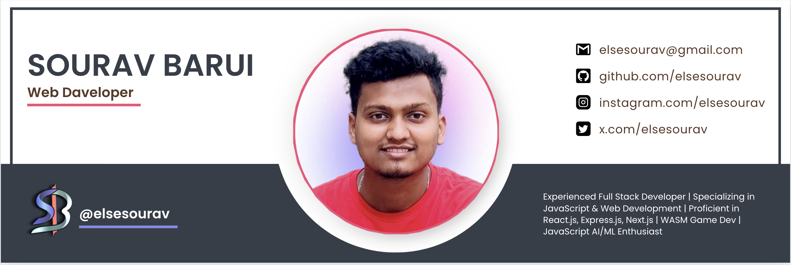

<h1 align="center"> Hello 👋, I'm Sourav Barui</h1>
<h3 align="center">A passionate full stack developer from India</h3>
 

   
   

     
   🌱 I’m currently learning <b>WASM, Next.js</b>
     
   📫 How to reach me <b>elsesourav@gamil.com</b>
   <h3>Connect with me:</h3>
   

      
      
      
      
   

 

### Languages and Tools:

   
   
   
   
   
   
   
   
   
   
   
   
   
   
   
   
   
   
   

 

&nbsp;&nbsp;&nbsp;&nbsp;

&nbsp;&nbsp;&nbsp;&nbsp;

 

<h1 align="center">TOP PROJECTS</h1>

## [**`Breakout Ball Game`**](https://elsesourav.github.io/breakout-ball/) 👈🏻
- Classic breakout gameplay with modern twists. Developed using WebAssembly, C++, JavaScript, HTML, CSS, and Firebase Database. [Github Repo](https://github.com/elsesourav/breakout-ball)
##### SCREENSHOTS

 
 

## [**`User Manager`**](https://elsesourav.github.io/user-manager/) 👈🏻
- The User Manager app is user friendly. Aims to simplify the management of users and groups. It provides a way to add delete users create groups and organize them effortlessly using drag and drop features. Open WhatsApp in Particular User, Run on both web and Android platforms. Best for **Network Marketing.** [Github Repo](https://github.com/elsesourav/user-manager/)
##### SCREENSHOTS

 
 

## [**`Neural Network Number Recognition`**](https://elsesourav.github.io/nn-number-rec/) 👈🏻
- Neural Network Number Recognition is a project designed to train a neural network to recognize handwritten numbers. The project includes features to input drawings, visualize the input, hidden, and output layers, dynamically change the learning rate, and save the trained network to achieve accurate number recognition. [Github Repo](https://github.com/elsesourav/nn-number-rec/)
##### SCREENSHOTS

