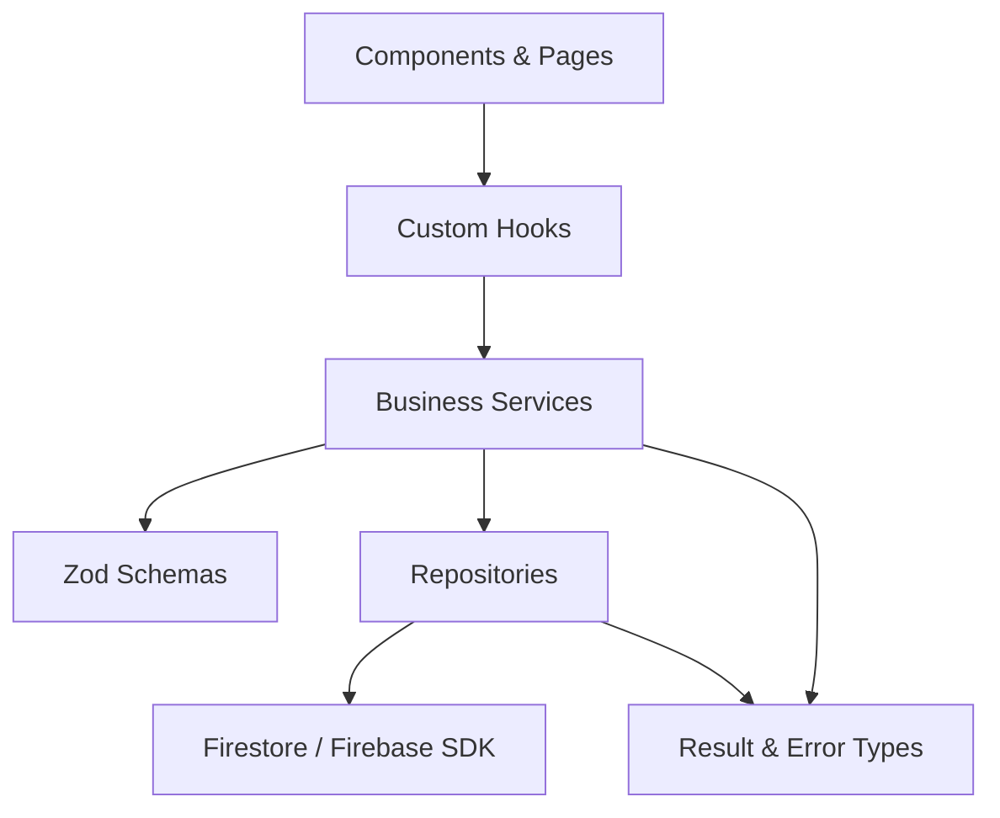

# ElseSourav Architecture & Engineering Conventions

This document defines the architectural standards, directory structure, conventions, and engineering principles for the ElseSourav platform.

---

## 1. Directory Structure & Responsibilities

```
src/
├── app/            # Application setup, providers hierarchy, error boundaries
├── assets/         # Static assets (images, SVGs, brand assets)
├── components/     # Reusable, domain-agnostic UI primitives (Buttons, Cards, Badges)
│   └── ui/         # Core UI building blocks
├── config/         # Strongly-typed environment and app configuration
├── constants/      # App-wide immutable constants (routes, navigation keys, limits)
├── features/       # Feature modules (feature-specific UI, hooks, services, types)
├── firebase/       # Firebase client config contract, initialization stubs, types
├── hooks/          # Shared, domain-agnostic custom React hooks
├── layouts/        # Layout shells (AppLayout, Header, Footer)
├── lib/            # External library wrappers, Result types, and Error classes
├── pages/          # Route-level page composition & view shells
├── repositories/   # Abstract repository contracts & Firestore data access layer
├── schemas/        # Zod validation schemas & inferred types
├── services/       # Application & business service contracts
├── styles/         # Global design tokens, CSS reset, glassmorphism utilities
├── tests/          # Test utilities, mocks, and harnesses
├── types/          # Shared domain, system, and utility types
└── utils/          # Pure, side-effect-free helper functions
```

---

## 2. Layer Responsibilities & Data Flow



- **UI Components** never perform direct Firestore calls or database queries.
- **Features** are self-contained modules. If logic is strictly scoped to one feature, keep it inside `src/features/<feature-name>/`.
- **Services** orchestrate business logic, validation, and multi-repository calls.
- **Repositories** encapsulate raw data access, serialization, and deserialization into domain models.
- **Schemas** validate untrusted input at runtime and infer static TypeScript types.

---

## 3. Engineering Conventions

### A. Naming Conventions

- **React Components**: `PascalCase.tsx` (e.g., `AppLayout.tsx`, `Button.tsx`, `Header.tsx`)
- **Hooks**: `camelCase.ts` starting with `use` (e.g., `useMediaQuery.ts`, `useMounted.ts`)
- **Services & Repositories**: `<name>.service.ts` / `<name>.repository.ts`
- **Schemas**: `<name>.schema.ts`
- **Types**: `<name>.types.ts`
- **Constants**: `SCREAMING_SNAKE_CASE` for values; files in `camelCase.ts` or `kebab-case.ts`.
- **Path Aliasing**: Always use `@/*` to reference `src/*` (e.g., `@/components/ui/Button`, `@/types`).

### B. Error Handling & Async Operations

- Use the **`Result<T, E>`** pattern (`src/lib/result.ts`) for recoverable operational errors.
- Throw structured **`AppError`** (`src/lib/errors.ts`) with clear error codes (`UNAUTHORIZED`, `NOT_FOUND`, `VALIDATION_ERROR`, `INTERNAL_ERROR`, `NETWORK_ERROR`).
- Never leave uncaught promise rejections or unhandled error cases.

### C. Type Safety Standards

- **No `any`**: Strictly prohibited and enforced by ESLint (`@typescript-eslint/no-explicit-any: error`).
- **Strict Mode**: `strict: true` and `noUncheckedIndexedAccess: true` must remain enabled.
- Avoid unsafe `as` type assertions; prefer type guards, narrowing, or Zod schema parsing.
- Use explicit return types on public service and repository APIs.
