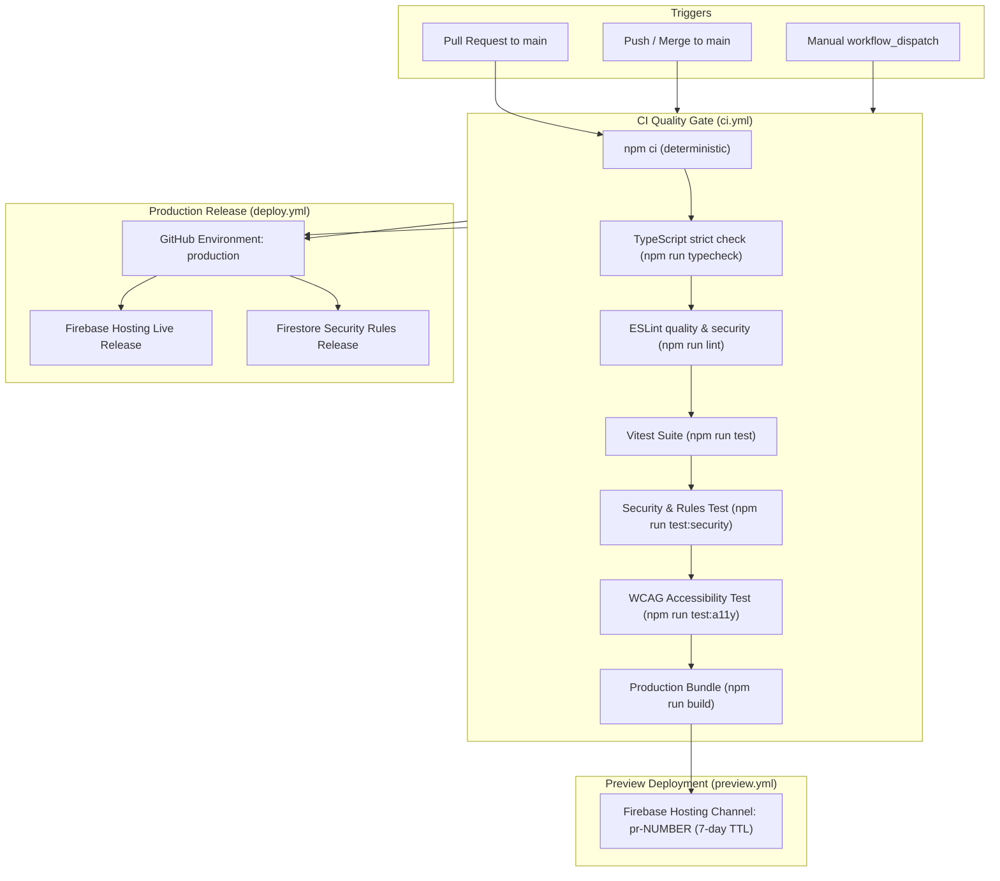

# Continuous Integration, Deployment & Operations Guide

> **Application**: ElseSourav  
> **Architecture**: Single-Publisher Client Single-Page Application (SPA)  
> **Stack**: React 19, Vite 6, TypeScript 5, Firebase Web SDK 12 (Auth & Firestore)  
> **Hosting & Cloud Infrastructure**: Firebase Hosting & Google Cloud Firestore

---

## 1. Overview & Operational Principles

ElseSourav is architected as a secure, high-performance, single-publisher application. The client bundle is statically generated and hosted via global CDN edge nodes on Firebase Hosting, communicating directly with Firebase Authentication and Cloud Firestore.

### Core Invariants

- **Deterministic Builds**: Strict `package-lock.json` dependency locking using `npm ci`.
- **Zero Raw Production Database Access in Tests**: CI and local test suites run in strictly isolated memory environments with mocked Firebase SDK services or local emulators.
- **Strict Quality Gating**: No code is merged into `main` or deployed to production without passing TypeScript strict checks, ESLint, Vitest regression tests, Firestore Security Rules validation, and Accessibility (WCAG) audits.
- **Privacy & Non-Exposure**: Production builds contain zero private server-side secrets or master database passwords. All client credentials are restricted public identifiers governed by Firestore Security Rules.

---

## 2. CI/CD Pipeline Architecture



---

## 3. GitHub Actions Workflows

| Workflow File                                                                                                  | Trigger                                         | Purpose                                           | Quality Enforcement                                                           |
| :------------------------------------------------------------------------------------------------------------- | :---------------------------------------------- | :------------------------------------------------ | :---------------------------------------------------------------------------- |
| [`.github/workflows/ci.yml`](file:///Users/sourav/Developer/WEB/elsesourav/.github/workflows/ci.yml)           | `push: [main]`, `pull_request: [main]`          | Complete quality gate & artifact creation         | Blocks PR if any test, lint, typecheck, or build fails.                       |
| [`.github/workflows/preview.yml`](file:///Users/sourav/Developer/WEB/elsesourav/.github/workflows/preview.yml) | `pull_request: [opened, synchronize, reopened]` | Ephemeral preview deployment for PR review        | Deploys to `channelId: pr-<number>` (7-day expiry). Never touches production. |
| [`.github/workflows/deploy.yml`](file:///Users/sourav/Developer/WEB/elsesourav/.github/workflows/deploy.yml)   | `push: [main]`, `workflow_dispatch`             | Production release gate & live hosting deployment | Requires full quality gate pass under `environment: production`.              |

---

## 4. Test Environment Isolation

To ensure tests never mutate production Firestore or query production users:

1. **Mock Services & Factories**: Tests in `src/tests/` and `src/services/__tests__/` use standardized test factories ([`createTestUser`](file:///Users/sourav/Developer/WEB/elsesourav/src/tests/fixtures/test-data.ts), [`createTestApp`](file:///Users/sourav/Developer/WEB/elsesourav/src/tests/fixtures/test-data.ts)) with in-memory state.
2. **Local Firebase Emulators**: For end-to-end rules verification, local emulator ports (`Auth: 9099`, `Firestore: 8080`) are configured in [`firebase.json`](file:///Users/sourav/Developer/WEB/elsesourav/firebase.json).
3. **CI Environment Overrides**: The CI runner injects synthetic test credentials (`VITE_APP_ENV=test`, `VITE_FIREBASE_API_KEY=mock-ci-api-key`), ensuring zero outbound production network calls occur during test execution.

---

## 5. Environment Secrets & Configuration

### Public Client Configuration (Safe in repository)

- `VITE_FIREBASE_API_KEY`: Client identifier
- `VITE_FIREBASE_AUTH_DOMAIN`: `elsesourav-8c9ad.firebaseapp.com`
- `VITE_FIREBASE_PROJECT_ID`: `elsesourav-8c9ad`
- `VITE_FIREBASE_APP_ID`: Web app identifier
- `VITE_SITE_ORIGIN`: `https://elsesourav.com`

### CI Secrets (Configured in GitHub Repository Secrets)

- `FIREBASE_SERVICE_ACCOUNT_ELSESOURAV`: Service account JSON key with `Firebase Hosting Admin` role for automated deployments.

---

## 6. Firestore Security Rules Deployment Policy

Firestore security rules in [`firestore.rules`](file:///Users/sourav/Developer/WEB/elsesourav/firestore.rules) govern all database read/write access.

### Pre-Deployment Rule Verification

Before any rule deployment, the CI pipeline executes:

```bash
npm run test:security
```

This runs [`src/tests/firestore-rules.test.ts`](file:///Users/sourav/Developer/WEB/elsesourav/src/tests/firestore-rules.test.ts) and [`src/tests/security-threat-scenarios.test.ts`](file:///Users/sourav/Developer/WEB/elsesourav/src/tests/security-threat-scenarios.test.ts) to verify:

- Non-admin users cannot write to `/apps`, `/categories`, `/tags`, `/blogPosts`, `/auditLogs`.
- Unauthenticated users cannot read private support tickets or user profiles.
- Role escalation attempts are rejected.

---

## 7. Rollback & Disaster Recovery Procedures

### 1. Instant Hosting Rollback (Sub-minute recovery)

If a release causes an unexpected client-side regression:

1. **Via Firebase Console**:
   - Navigate to **Firebase Console** $\to$ **Hosting** $\to$ **Release History**.
   - Locate the previous known-good deployment and click **Rollback**.
2. **Via Firebase CLI**:
   ```bash
   firebase hosting:clone elsesourav:<previous-version-id> elsesourav:live
   ```

### 2. Firestore Security Rules Rollback

If a newly deployed security rule causes authorization regressions:

1. Revert the commit in Git:
   ```bash
   git revert HEAD
   git push origin main
   ```
2. Or immediately re-deploy previous known-good rules:
   ```bash
   firebase deploy --only firestore:rules
   ```

### 3. Data Integrity & Non-Destructive Data Policy

- Application data in Cloud Firestore is immutable or append-only where appropriate (e.g. Audit Logs, Support Tickets).
- **Never perform automated mass database deletions or blind collection drops**.
- Refer to [`docs/BACKUP_AND_RECOVERY.md`](file:///Users/sourav/Developer/WEB/elsesourav/docs/BACKUP_AND_RECOVERY.md) for scheduled Firestore export and point-in-time recovery guidelines.

---

## 8. Local Quality Gate Execution

To validate the entire build and testing pipeline locally before pushing commits:

```bash
# 1. Strict TypeScript compilation check
npm run typecheck

# 2. ESLint code quality & architecture lint
npm run lint

# 3. Complete Vitest test suite
npm run test

# 4. Security threat scenarios & rule tests
npm run test:security

# 5. WCAG Accessibility audit
npm run test:a11y

# 6. Production bundle build & sitemap generation
npm run build

# OR Run the Turnkey Verification Pipeline:
npm run validate
```
