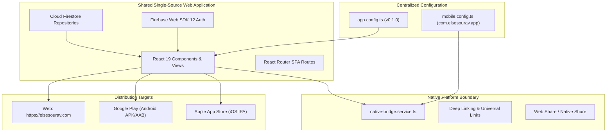

# Mobile Application Distribution Guide (Android & iOS)

> **Application**: ElseSourav  
> **Mobile Architecture**: Capacitor Native Web Container  
> **Source of Truth**: Single Shared React 19 + Vite 6 + TypeScript Codebase  
> **Target Stores**: Google Play Store (Android) & Apple App Store (iOS)

---

## 1. Packaging Approach & Architectural Decision

ElseSourav utilizes **Capacitor** to package the production web build (`dist/`) into native Android and iOS application shells:



### Why Capacitor was Chosen:
1. **Zero Code Duplication**: 100% of UI components, validation schemas, Firestore repositories, authentication flows, and styling tokens are shared directly.
2. **No Separate Framework**: Avoids maintaining a detached React Native or Flutter codebase.
3. **Web Standards First**: The web application remains the primary, independent source of truth without platform-specific hacks.
4. **Reliable WebView Security**: Modern WebViews on Android (Chromium) and iOS (WKWebView) support full modern standards (ES2022, IndexedDB, CSS variables, CSS safe areas).

---

## 2. Shared Code vs Native Boundary Matrix

| Layer | Shared (Web + Mobile) | Mobile Specific |
| :--- | :--- | :--- |
| **Business Logic** | 100% Shared (`src/services/`, `src/repositories/`) | None |
| **Authentication** | 100% Shared (Firebase Auth SDK) | Handled natively by WebKit/Chromium storage |
| **Domain Models** | 100% Shared (`src/types/`, `src/schemas/`) | None |
| **Routing** | 100% Shared (`src/routes/AppRoutes.tsx`) | Deep link URL dispatcher to SPA router |
| **Design System** | 100% Shared (`src/styles/`, CSS Tokens) | `env(safe-area-inset-*)` safe notch spacing |
| **Native Bridge** | Standard Web APIs (`navigator.share`, `window.open`) | Capacitor Plugin integration via [`nativeBridge`](file:///Users/sourav/Developer/WEB/elsesourav/src/services/native-bridge.service.ts) |

---

## 3. Platform Identifiers & Configuration

Defined in [`src/config/mobile.config.ts`](file:///Users/sourav/Developer/WEB/elsesourav/src/config/mobile.config.ts) and [`capacitor.config.ts`](file:///Users/sourav/Developer/WEB/elsesourav/capacitor.config.ts):

| Parameter | Configuration Value | Platform Requirement |
| :--- | :--- | :--- |
| **Application ID (Android)** | `com.elsesourav.app` | Reverse-domain style identifier for Google Play Console |
| **Bundle ID (iOS)** | `com.elsesourav.app` | Reverse-domain style identifier for Apple App Store Connect |
| **Application Name** | `ElseSourav` | User-facing display title under launcher icon |
| **Application Version** | Dynamic from `package.json` (`0.1.0`) | SemVer platform release version |
| **Build Number** | `1` | Integer version code for store updates |
| **Custom Scheme** | `elsesourav://` | Inter-app deep linking |
| **Universal Hostname** | `elsesourav.com` | Verified App Links / Universal Links |

---

## 4. Authentication in Native WebViews

- **Session Persistence**: Firebase Auth uses IndexedDB in both Chromium Android WebView and iOS WKWebView, persisting user sessions seamlessly across app restarts.
- **Email/Password & Verification**: Fully functional without native SDK dependencies.
- **Zero Exposure**: Client configuration remains public client identifiers; database access is secured by Firestore Security Rules.

---

## 5. Permissions & Privacy Policy

ElseSourav strictly adheres to the principle of least privilege:

```ts
permissions: {
  camera: false,
  microphone: false,
  location: false,
  contacts: false,
  photos: false,
  bluetooth: false,
}
```

- **Zero Invasive Hardware Permissions**: The native manifest requests **no** access to device cameras, microphones, background location, contacts, or photo libraries.
- **Network Access Only**: Standard `android.permission.INTERNET` for Firebase communication.

---

## 6. Deep Linking & Universal Links Architecture

Incoming URLs are verified against an explicit security allowlist and dispatched to the internal React router via [`nativeBridge.handleDeepLink()`](file:///Users/sourav/Developer/WEB/elsesourav/src/services/native-bridge.service.ts):

### A. Supported Public Deep-Link Routes
- Applications Directory & Details: `https://elsesourav.com/apps`, `https://elsesourav.com/apps/:slug`
- Blog & Engineering Articles: `https://elsesourav.com/blog`, `https://elsesourav.com/blog/:slug`
- Help Center & Knowledge Base: `https://elsesourav.com/help`, `https://elsesourav.com/help/:category`, `https://elsesourav.com/help/:category/:article`
- Search & Discovery: `https://elsesourav.com/search`
- Creator Showcase & Legal: `https://elsesourav.com/about`, `/privacy`, `/terms`, `/cookies`, `/accessibility`

### B. Explicitly Excluded Routes (Never Deep-Linked into Native)
- Administrative Control Center (`/admin/*`)
- User Settings & Account Management (`/settings/*`)
- Private Support Tickets & Threads (`/support/tickets/*`)
- Personal Software Library (`/library`)
- Authentication Flows (`/login`, `/signup`, `/forgot-password`)

### C. Android App Links (`/.well-known/assetlinks.json`)
- Hosted statically at: `https://elsesourav.com/.well-known/assetlinks.json`
- Verification is automatically performed by Android OS on app install.
- To obtain the production SHA256 fingerprint from your release keystore:
  ```bash
  keytool -list -v -keystore release-key.jks -alias elsesourav
  ```
  Replace `REPLACE_WITH_PRODUCTION_RELEASE_KEYSTORE_SHA256_FINGERPRINT` in `public/.well-known/assetlinks.json` with the output.

### D. iOS Universal Links (`/.well-known/apple-app-site-association`)
- Hosted statically at: `https://elsesourav.com/.well-known/apple-app-site-association`
- Configured with Associated Domains entitlement: `applinks:elsesourav.com`.
- Replace `TEAM_ID_PLACEHOLDER` with your 10-character Apple Developer Team ID.

### E. Web Fallback & Open Redirect Defense
- When the mobile app is **not** installed, all links open normally in standard desktop or mobile web browsers.
- Query parameters containing redirects (`?redirect=...`) are strictly sanitized through `safeRedirectPath()` to prevent open-redirect vulnerabilities.

## 7. Build & Packaging Commands

```bash
# 1. Compile verified web production bundle
npm run build

# 2. Synchronize web assets to native Android and iOS projects
npm run mobile:sync

# 3. Open native IDE for release compilation (requires Android Studio / Xcode)
npm run mobile:open:android
npm run mobile:open:ios
```

---

## 8. Remaining Native Tooling Requirements

To generate the final binary artifacts for Google Play and Apple App Store:

1. **Android Studio**:
   - Install Android Studio and Android SDK (API 34+).
   - Generate signing keystore (`.jks`) for Google Play App Signing.
   - Run `npx cap add android` to generate the `android/` native container project.
2. **Xcode (macOS)**:
   - Install Xcode and Command Line Tools.
   - Apple Developer Account provisioning profile for Bundle ID `com.elsesourav.app`.
   - Run `npx cap add ios` to generate the `ios/` native container project.
