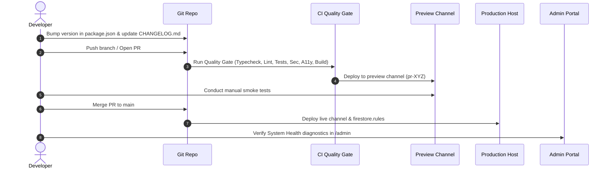

# Professional Release Management & Operations Workflow

> **Platform**: ElseSourav  
> **Maintainer Model**: Single Maintainer / Developer  
> **Versioning Model**: Semantic Versioning ([SemVer 2.0.0](https://semver.org/))  
> **Changelog Standard**: [Keep a Changelog](https://keepachangelog.com/en/1.0.0/)

---

## 1. Authoritative Version Strategy

The single source of truth for the application version is `package.json`:

```json
{
  "version": "0.1.0"
}
```

- **Compile-Time Injection**: Vite injects `__APP_VERSION__` into [`appConfig.version`](file:///Users/sourav/Developer/WEB/elsesourav/src/config/app.config.ts) during build.
- **Zero Manual Duplication**: Components, telemetry services, error loggers, and footer labels reference `appConfig.version`.

---

## 2. Release Preparation & Safety Lifecycle



### Step 1: Version Increment & Changelog Update
1. Update `"version"` in `package.json` (`npm version minor --no-git-tag-version` or manual edit).
2. Add the release entry in [`CHANGELOG.md`](file:///Users/sourav/Developer/WEB/elsesourav/CHANGELOG.md) with categories:
   - `Added`
   - `Changed`
   - `Fixed`
   - `Security`
   - `Performance`
3. Append release notes to [`src/config/releases.config.ts`](file:///Users/sourav/Developer/WEB/elsesourav/src/config/releases.config.ts) for Admin in-app visibility.

### Step 2: Local Pre-Flight Quality Check
Before pushing to remote:
```bash
npm run validate
```
Ensures:
- TypeScript strict check passes (`tsc --noEmit`).
- ESLint rules pass (`eslint .`).
- All 100 test suites and 851 unit/integration/security tests pass (`vitest run`).
- Production bundle builds cleanly (`vite build` + sitemap generation).

### Step 3: Git Tagging Convention
Tag release commits on `main` following strict SemVer:
```bash
git tag -a v0.1.0 -m "Release v0.1.0: Initial Production Release Candidate"
git push origin v0.1.0
```

### Step 4: Preview Channel Validation
On PR creation, `.github/workflows/preview.yml` deploys an ephemeral channel:
- Preview URL: `https://elsesourav--pr-XYZ-hash.web.app` (Expires in 7 days).
- Conduct functional smoke tests on real mobile & desktop viewports before merging.

### Step 5: Production Deployment & Live Verification
Merge the PR into `main`. The `.github/workflows/deploy.yml` workflow automatically:
1. Re-executes all CI quality gates.
2. Compiles verified production bundles into `dist/`.
3. Deploys to Firebase Hosting live channel (`elsesourav.web.app` / `elsesourav.com`).
4. Deploys validated Firestore Security Rules.

---

## 3. Database & Security Rule Mutation Safety

### Strict Separation of Frontend vs Database Changes
- **No Blind Rule Overwrites**: Security rules are validated through `npm run test:security` prior to deployment.
- **Additive Data Migrations**: When introducing new Firestore schemas or entity fields:
  1. Make new fields optional or provide backward-compatible fallback values in schema parsers (Zod).
  2. Deploy application code supporting both old and new schema shapes.
  3. Run any data migration scripts incrementally.
  4. Only deprecate old schema fields after all active clients have transitioned.
- **Zero Automated Deletions**: CI/CD pipelines **never** drop Firestore collections or truncate user data.

---

## 4. Safe Rollback Procedures

### 1. Application Code Rollback (Instant)
If a critical client regression is discovered in production:
- **Firebase Console**: Go to **Hosting** $\to$ **Release History** $\to$ Click **Rollback** next to the previous release (< 60 seconds).
- **Firebase CLI**:
  ```bash
  firebase hosting:clone elsesourav:<previous-release-id> elsesourav:live
  ```

### 2. Service Worker & Cache Invalidation
- [`public/sw.js`](file:///Users/sourav/Developer/WEB/elsesourav/public/sw.js) and `index.html` are served with `Cache-Control: no-cache, no-store, must-revalidate`.
- When a rollback or new release is published, the service worker detects the changed bytehash immediately on subsequent navigation, downloads new hashed bundles, and activates without requiring user cache clearing.

### 3. Firestore Security Rules Rollback
If a security rule regression is detected:
```bash
git checkout <previous-tag-or-commit> -- firestore.rules
firebase deploy --only firestore:rules
```

### 4. Data Rollback Limitations (CRITICAL)
> [!WARNING]
> **Rolling back frontend application code or hosting releases does NOT roll back Cloud Firestore data.**
> User library saves, support tickets, and audit logs created during a buggy release remain in the database. Data repairs must be executed through safe, idempotent administrative scripts or restored from Google Cloud Point-in-Time Firestore Backups (refer to `docs/BACKUP_AND_RECOVERY.md`).
