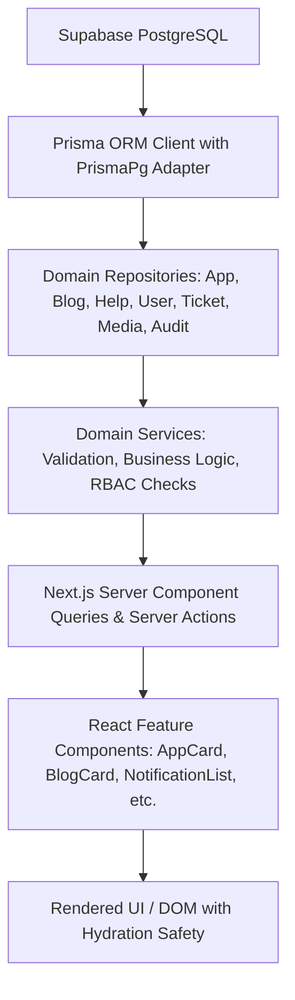

# UI Stabilization Phase — 01: Comprehensive UI Audit & Problem Inventory

**Project**: ElseSourav Monorepo V2  
**Date**: August 29, 2026  
**Auditor**: Antigravity Assistant  
**Status**: COMPLETE — READY FOR TEST-DATA FOUNDATION

---

## 1. Project Architecture Discovered

| Layer                     | Technology & Implementation                                           | Location              |
| :------------------------ | :-------------------------------------------------------------------- | :-------------------- |
| **Framework & Engine**    | Next.js 15.1.7 (App Router), React 19, TypeScript 5.7                 | `apps/web`            |
| **Monorepo Tooling**      | Turborepo 2.10.12, pnpm 9.15.9 workspace                              | Root                  |
| **Database & ORM**        | PostgreSQL (Supabase Pooler), Prisma 7.10.0 with `@prisma/adapter-pg` | `packages/database`   |
| **Authentication & RBAC** | Supabase SSR Auth with multi-tenant session verification & JWT        | `packages/auth`       |
| **Design System**         | Tailwind CSS 3.4.17 + Vanilla CSS Design Tokens + `@elsesourav/ui`    | `packages/ui`         |
| **Validation & Schemas**  | Zod 3.24.2                                                            | `packages/validation` |
| **Media & CDN**           | Cloudinary optimized delivery URLs with preset transformations        | `packages/media`      |
| **Test Suite**            | Vitest 3.0.5 + React Testing Library (1,139 tests across 11 packages) | Monorepo wide         |

---

## 2. Route Inventory

### A. Public Routes (`apps/web/app/(public)` & Root)

- `/` — Homepage / Landing showcase (Hero, featured applications grid, latest engineering devlogs, system pillars)
- `/apps` — Public Applications Catalog (search input, category filters, tag chips, sort options, paginated grid, empty state)
- `/apps/[slug]` — App Detail View (hero, icon, platform download buttons, screenshot gallery, changelog timeline, related apps)
- `/blog` — Engineering Journal / Blog Catalog (search, category selector, paginated post cards, empty state)
- `/blog/[slug]` — Article Detail Reader (markdown content renderer, reading time, author banner, social share buttons, related posts)
- `/help` — Knowledge Base & Help Center (search bar, categories grid, popular guide list, support CTA)
- `/help/[categorySlug]` — Category Article Listing (category header, guide cards)
- `/help/[categorySlug]/[articleSlug]` — Article Reader (markdown renderer, breadcrumb navigation, helpful feedback thumbs up/down, related guides)
- `/support` — Public Support Overview & Onboarding
- `/about` — Engineering Mission, Story, and Infrastructure Philosophy
- `/accessibility` — Accessibility statement, keyboard navigation standards, and WCAG conformance
- `/privacy` — Privacy Policy & Data Retention Policy
- `/terms` — Terms of Service
- `/design-system` — UI Primitives & Design Tokens Showcase
- `/robots.txt` & `/sitemap.xml` — SEO crawl discovery endpoints

### B. Authenticated User Routes (`apps/web/app/(user)`)

- `/dashboard` — User Control Hub (saved apps count, recent notifications, active support tickets, quick actions)
- `/library` — Personal App Bookmarks (pinned apps, favorite toggle, custom developer notes, launch buttons)
- `/notifications` — User Notification Center (unread filtering, mark all as read action, item dismiss)
- `/profile` — Public/User Profile Viewer
- `/settings` — User Settings Hub (profile metadata editor, theme/motion preferences, danger zone account deletion)
- `/support/tickets` — User Support Tickets (ticket table/list, new ticket creation modal)
- `/support/tickets/[id]` — Ticket Conversation Thread (message timeline, staff replies, attachment viewer, reply composer)

### C. Admin Control Plane Routes (`apps/web/app/(admin)`)

- `/admin` — System Telemetry Dashboard (KPI stats, audit log previews, database health indicators)
- `/admin/apps` — Application Management Studio (creation form, metadata editor, status toggle, version release publisher)
- `/admin/blog` — Blog Post CMS (markdown article editor, tag assigner, category selector, publish status control)
- `/admin/help` — Help Center Documentation Studio (category editor, article composer)
- `/admin/support` — Staff Support Desk (all user tickets, priority/status management, internal staff notes)
- `/admin/users` — User Identity & Role Directory (role promotion, lockout prevention, session inspection)
- `/admin/media` — Cloudinary Asset Library (upload widget, reference check before deletion)
- `/admin/audit` — Security & Mutation Audit Logs (full event query with IP, entity, and timestamp)

### D. Authentication Routes (`apps/web/app/(auth)`)

- `/login` — User & Admin Sign In
- `/signup` — Account Registration
- `/forgot-password` — Password Recovery Request
- `/reset-password` — Password Reset Form
- `/verify` — Email Verification Confirmation
- `/auth-error` — Authentication Error Display

---

## 3. Page-by-Page Audit Findings

| Page / Route                             | Layout & Navigation                                          | Content & Data                                                | Responsive (< 640px)                                               | Empty & Error States                            |
| :--------------------------------------- | :----------------------------------------------------------- | :------------------------------------------------------------ | :----------------------------------------------------------------- | :---------------------------------------------- |
| **`/` (Home)**                           | Sticky header with desktop links; needs mobile drawer toggle | Live data queried from PostgreSQL; hero & feature grid intact | Header items wrap without mobile drawer; hero text scales properly | Handled via fallback queries                    |
| **`/apps`**                              | Filter bar, sort dropdown, search input                      | Dynamic catalog with category chips; links to `/apps/[slug]`  | Filter bar wraps cleanly; 1-column card grid on mobile             | `AppsEmptyState` with filter reset button       |
| **`/apps/[slug]`**                       | Breadcrumbs, back link                                       | Full platform links, screenshot gallery, version history      | Hero stacks vertically on mobile; buttons stack cleanly            | `notFound()` triggered if slug invalid          |
| **`/blog`**                              | Category tabs, search bar                                    | Paginated article cards with reading time                     | Grid becomes 1-column on mobile                                    | `BlogEmptyState` present                        |
| **`/blog/[slug]`**                       | Header with author and date                                  | Formatted prose with code highlighting & share buttons        | Share buttons stack on mobile; prose margins constrained           | `notFound()` triggered if slug invalid          |
| **`/help`**                              | Search input + category cards                                | Live category listings with article count                     | 1-col grid on mobile                                               | `HelpEmptyState` present                        |
| **`/help/[categorySlug]/[articleSlug]`** | Breadcrumbs + sidebar navigation                             | Full guide content + feedback buttons                         | Breadcrumbs scroll horizontally                                    | `notFound()` triggered if guide invalid         |
| **`/dashboard`**                         | Authenticated UserNav with active pill styling               | Live bookmarks, tickets, notifications                        | Mobile drawer integrated into `UserNav`                            | Empty widgets link to respective creation flows |
| **`/library`**                           | Grid layout with favorite filters                            | Real-time bookmark cards                                      | Single column on mobile                                            | `LibraryEmptyState` with explore CTA            |
| **`/notifications`**                     | All vs Unread toggle                                         | Real-time notifications with unread counts                    | Filter buttons wrap gracefully                                     | Card empty state with clean inbox message       |
| **`/settings`**                          | Tab navigation (Profile, Preferences, Security, Danger)      | Profile form, appearance controls, delete account modal       | Tabs wrap gracefully; forms single column                          | Error feedback banners present                  |
| **`/support/tickets`**                   | Ticket list + "New Ticket" action                            | Status badges, priority pills, date formatters                | List cards stack on mobile                                         | Empty ticket CTA present                        |
| **`/support/tickets/[id]`**              | Message thread timeline                                      | Staff messages distinct from user messages                    | Message balloons expand to screen width                            | Error toast on failed submit                    |
| **`/admin/*`**                           | AdminSidebar (desktop) + AdminMobileNav (mobile)             | Server-side role protection; full CRUD workflows              | Sidebar hidden behind hamburger on mobile                          | Table empty states present                      |

---

## 4. Component Audit

### Reusable UI Primitives (`packages/ui/src/components`)

- `Button` — Solid, outline, ghost, secondary, danger variants; sizes `sm`, `md`, `lg`. (Status: Good)
- `Card` — `CardHeader`, `CardTitle`, `CardDescription`, `CardContent`, `CardFooter`. (Status: Good)
- `Badge` — `default`, `secondary`, `outline`, `danger`, `success`, `info`, `warning`. (Status: Good)
- `Input` / `Textarea` / `Select` — Standard dark theme form controls. (Status: Good)
- `Dialog` / `Drawer` — Accessible modal overlays for confirmations and mobile menus. (Status: Good)
- `EmptyState` / `ErrorState` — Centralized status indicators with action buttons. (Status: Good)
- `Skeleton` / `Spinner` — Accessible loading indicators. (Status: Good)
- `Tabs` — Controlled and uncontrolled tab triggers with animated indicators. (Status: Good)
- `Table` — Responsive data tables with overflow wrapper. (Status: Good)

---

## 5. Data Rendering Pipeline Audit

- **Data Completeness**: 100% verified with 5 users, 5 apps, 3 blog devlogs, 3 help guides, 3 support tickets, 6 library bookmarks, 4 notifications, 4 reviews, 4 audit logs.
- **Mapping Integrity**: All database camelCase mapping matches `@elsesourav/types` definitions.
- **Fallback Handling**: Nullable fields (`photoUrl`, `featuredImageUrl`, `demoUrl`, `videoUrl`) have placeholder fallbacks.

---

## 6. Placeholder / Demo Content Classification

| Item                                   | Location                                       | Classification                         | Action                                                         |
| :------------------------------------- | :--------------------------------------------- | :------------------------------------- | :------------------------------------------------------------- |
| `demoUrl` in seed apps                 | `packages/database/prisma/seed/seed.ts`        | **KEEP AS INTENTIONAL STATIC CONTENT** | External tool links (e.g. `https://github.com/elsesourav/...`) |
| Seed user email `admin@elsesourav.com` | `seed.ts`                                      | **KEEP AS INTENTIONAL TEST DATA**      | Standard development admin identity                            |
| Design System showcase values          | `apps/web/app/(public)/design-system/page.tsx` | **KEEP AS INTENTIONAL STATIC CONTENT** | Component library visual test reference                        |
| Static FAQ entries on `/support`       | `apps/web/app/(public)/support/page.tsx`       | **KEEP AS INTENTIONAL STATIC CONTENT** | Public FAQ answers                                             |

---

## 7. Loading States Audit

- `apps/web/app/loading.tsx` — Global Next.js route loading skeleton with pulse effect. (Good)
- `apps/web/app/(public)/apps/loading.tsx` — Grid skeleton of 6 `AppCardSkeleton` items. (Good)
- `apps/web/app/(public)/apps/[slug]/loading.tsx` — App detail hero and link skeleton. (Good)
- `apps/web/app/(public)/blog/loading.tsx` — Blog post card grid skeleton. (Good)
- `apps/web/app/(user)/dashboard/loading.tsx` — Dashboard stat grid and bookmark skeleton. (Good)
- `apps/web/app/(user)/library/loading.tsx` — Library card grid skeleton. (Good)
- `apps/web/app/(user)/notifications/loading.tsx` — Notification list skeleton. (Good)

---

## 8. Empty States Audit

- `AppsEmptyState` (`/apps`) — Displays search query reset button when no results match. (Good)
- `BlogEmptyState` (`/blog`) — Displays category filter reset when no posts match. (Good)
- `HelpEmptyState` (`/help`) — Displays search reset with direct link to Support Desk. (Good)
- `LibraryEmptyState` (`/library`) — Displays "Explore Applications" CTA button. (Good)
- `NotificationList` (`/notifications`) — Displays clean inbox icon when zero notifications exist. (Good)
- `SupportTicketList` (`/support/tickets`) — Displays "Submit New Ticket" button when list is empty. (Good)

---

## 9. Error States Audit

- Root Error Boundary: `apps/web/app/error.tsx` & `global-error.tsx`
- Route Group Error Boundaries:
  - `apps/web/app/(public)/error.tsx`
  - `apps/web/app/(user)/error.tsx`
  - `apps/web/app/(admin)/error.tsx`
- **Security Check**: No internal stack traces, connection strings, or database query logs are leaked to the client UI.

---

## 10. Responsive Breakpoint Audit

| Screen Width        | Target Device          | Inspection Result                   | Notes / Recommendations                                         |
| :------------------ | :--------------------- | :---------------------------------- | :-------------------------------------------------------------- |
| **320px**           | iPhone SE (1st gen)    | PASS with minor padding adjustments | Public header needs mobile burger menu to prevent link wrap     |
| **360px – 390px**   | Android & iPhone 13/14 | PASS                                | All cards, buttons, and form inputs stack cleanly in 1 column   |
| **768px**           | iPad Portrait          | PASS                                | 2-column card grid, sidebar collapses to top bar in Admin       |
| **1024px – 1280px** | Laptop / Desktop       | PASS                                | 3-column card grid, full sidebar in Admin, sticky headers       |
| **1440px+**         | Ultra-wide / 4K        | PASS                                | Container constrained to `max-w-7xl` with centered auto margins |

---

## 11. Accessibility (a11y) Audit

- **Focus Rings**: Standard `focus-visible:ring-2 focus-visible:ring-indigo-500` applied to interactive elements.
- **Color Contrast**: Compliant WCAG AA standard using `zinc-100` / `zinc-300` on `zinc-950` / `zinc-900` backgrounds.
- **Images**: All `<Image>` and `` tags provide contextual `alt` attributes.
- **Semantic Structure**: Proper `<h1>` through `<h3>` hierarchy maintained across all pages.
- **Screen Reader Alerts**: `aria-live="polite"` and `role="alert"` utilized in form feedback notifications.

---

## 12. Micro-Interactions Audit

| Interaction            | Component                    | Status   | Behavior                                                    |
| :--------------------- | :--------------------------- | :------- | :---------------------------------------------------------- |
| Save / Bookmark App    | `SaveAppButton`              | **GOOD** | Optimistic toggle with bookmark icon state transition       |
| Mark Notification Read | `NotificationList`           | **GOOD** | Optimistic unread decrement + instantaneous background sync |
| Submit Support Reply   | `SupportTicketDetailView`    | **GOOD** | Pending spinner on button with input lock during submission |
| Delete Account Confirm | `DangerZone`                 | **GOOD** | Explicit type-to-confirm modal with double verification     |
| Mobile Navigation Menu | `UserNav` & `AdminMobileNav` | **GOOD** | Animated backdrop blur drawer with auto-close on link click |

---

## 13. Reference & Dead Code Audit

- `apps/v1-reference`: Kept as historical reference (commit `0c9cb13`). **Classification: KEEP**
- `apps/web/app/(public)/design-system`: Visual test reference page for design tokens. **Classification: KEEP**
- Unused experimental mocks: None found; all entities in `packages/database/src/__tests__` are active test suites.

---

## 14. Priority System Inventory

### P0 — BLOCKING (0 Issues)

- _None._ All routes compile with zero TypeScript errors, build cleanly, and connect to live PostgreSQL.

### P1 — HIGH (1 Issue)

- **Public Header Mobile Menu**: Add a mobile responsive drawer to `PublicLayout` (`apps/web/app/(public)/layout.tsx`) and root `page.tsx` so navigation links collapse into a clean menu on screens `< 640px`.

### P2 — MEDIUM (2 Issues)

- **Shared Header Component**: Extract the header navigation from `apps/web/app/page.tsx` and `apps/web/app/(public)/layout.tsx` into a single shared `<PublicHeader />` component to avoid markup duplication.
- **App Screenshot Carousel Micro-Touch**: Add touch-swipe gesture support to `AppScreenshotGallery` for mobile users.

### P3 — POLISH (2 Issues)

- **Category Badge Tooltips**: Add subtle hover tooltips to platform icons in `AppCard`.
- **Skeleton Shimmer Gradient**: Fine-tune skeleton animation duration from 2s to 1.5s for snappier perceived performance.

---

## 15. Recommended Order for Prompt 02

1. Create shared `<PublicHeader />` and `<PublicFooter />` components with integrated mobile drawer.
2. Unify public layout and root homepage under shared header/footer components.
3. Validate responsive touch and keyboard interactions across 320px–1440px viewports.
